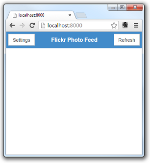

#Flickr Photo Feed App - The List View

We will now begin to create our [Flickr photo feed viewer application](FlickrApp).

It is time to open your favorite editor or IDE and load the `index.html` file of the application in it.

##HTML and CSS

The layout of the default application that we generated using Yeoman is roughly similar to what we want: a header
on top, and contents that fit the remaining page space below. So we will keep the existing structure to make our list 
view, that is, a (vertical) `d-linear-layout` and another nested, horizontal `d-linear-layout` for the header.

Edit the contents of the `d-linear-layout` below the `<!-- page content -->` as follows:

````
	<!-- page content -->
	<d-linear-layout class="page width100 height100" id="listView">
        <!-- page content header -->
        <d-linear-layout vertical="false" class="pageHeader">
            <div>
                <button is="d-button" onclick="leftPane.toggle()">Settings</button>
            </div>
            <div class="fill titleStyle">Flickr Photo Feed</div>
            <div>
                <button is="d-button" onclick="refreshPhotoList()">Refresh</button>
            </div>
        </d-linear-layout>
        <!-- page content will go here -->
	</d-linear-layout>
````

We have changed some labels, set an `id` attribute on the view and added a second button after the title (the nested
`d-linear-layout` will automatically stack it on the right because the middle div has a `fill` class).

We also need to change the CSS, so open `css/app.css` in your editor. To keep things simple,
remove all the existing content and add these rules to define the look of our new header:

````
.pageHeader {
    background-color: #428bca;
    color: white;
    height: 48px;
    border-bottom: 2px solid #357ebd;
    padding: 0.3em;
}
.titleStyle {
    text-align: center;
    line-height: 40px;
    font-weight: bold;
    font-size: 16px;
}
.d-button {
    border-radius: 0;
}
````

(You can also remove the `css/delitefont.*` files as we won't use them in this tutorial).

If you open `index.html` in your browser now, you should get something like this:



A difference with the default application, though, is that in our case, we want a second view (the details view) to
completely replace the list view (including the header), whereas in the default application only the contents is
replaced and the header stays.

To achieve that, we will wrap our toplevel `d-linear-layout` inside a `d-view-stack`:

````
<!-- page content -->
<d-view-stack class="page width100 height100" id="vs">
	<d-linear-layout class="width100 height100" id="listView">
	...
	</d-linear-layout>
</d-view-stack>
````

Note that we moved the `page` class to the toplevel `d-view-stack`: the `page` class should always be on the toplevel
 component of the page.

Finally, we want to display a list of photos, so let's add a `d-list` component as the contents of our view. For
this, replace the `<!-- page content will go here -->` placeholder by a

````
        <!-- scrollable list -->
        <div class="fill">
            <d-list class="width100 height100" id="photolist">
            </d-list>
        </div>
````

And also add this in `css/app.css` to ensure the list is correctly sized
(see [the LinearLayout doc](http://ibm-js.github.io/deliteful/docs/master/LinearLayout.html#configuration)
for more details on why this is needed)

````
#photolist {
    position: absolute
}
````

##Getting the Photo List from Flickr

It is now time to write some JavaScript code. The default app contains a `<script>` tag with inline code,
but a better practice is to put code in a separate file.

Create the `js` directory, create an `app.js` file. Copy the existing code from index.html,
paste it in the new `app.js` file, removing the last line which we don't need:

````
			require.config({
				baseUrl: "bower_components"
			});
			require(["delite/register", "delite/theme!delite/themes/{{theme}}/global.css", "deliteful/ViewStack",
					"deliteful/SidePane", "deliteful/LinearLayout", "deliteful/Button", "deliteful/StarRating",
					"deliteful/ProgressBar", "deliteful/list/List", "requirejs-domready/domReady!"], function(register) {
				register.parse();
				document.body.style.display = "";
				<!-- app code will go here -->
			});
````

Then remove the existing code in `index.html` and load the new `.js` file instead:

````
<head>
    ...
    <script src="js/app.js"></script>
</head>
````

To get the photos, we will use the
[Flickr API to retrieve photos feeds based on tags](https://www.flickr.com/services/feeds/docs/photos_public/).
We will request the photos in `json` format and use the [JSONP](http://en.wikipedia.org/wiki/JSONP) communication
technique. (JSONP is not very commonly used in real world applications, but it has the advantage of not requiring to
setup any server-side code, and it is good enough to simulate a server request in our example app).

Here is the code that does the JSONP request, paste it in your `app.js` file at the end of the `require` function
(after the `<!-- app code will go here -->` comment).

````
	var script;

	// Makes a request to the Flickr API to get recent photos with the specified tag.
	// When the request completes, the "photosReceived" function will be called with json objects
	// describing each photo.
	function getPhotos(tags) {
		requestDone();

		pi.active = true;

		var url = "http://api.flickr.com/services/feeds/photos_public.gne?format=json&jsoncallback=photosReceived&tags=" +
			tags + "&tagmode=" + settings.tagMode;
		script = document.createElement("script");
		script.type = 'text/javascript';
		script.src = url;
		script.async = true;
		script.charset = 'utf-8';
		document.getElementsByTagName('head')[0].appendChild(script);
	}

	// Must be called to cleanup the current JSONP request (i.e. remove the "script" element).
	function requestDone() {
		if (script && script.parentNode) {
			script.parentNode.removeChild(script);
			script = null;
		}
		pi.active = false;
	}
````

We won't go into the details of the code, but in short this code sends a request to Flickr,
and the reply is a JSON string that calls the `photosReceived` function with the list of photo
descriptions as parameter.

